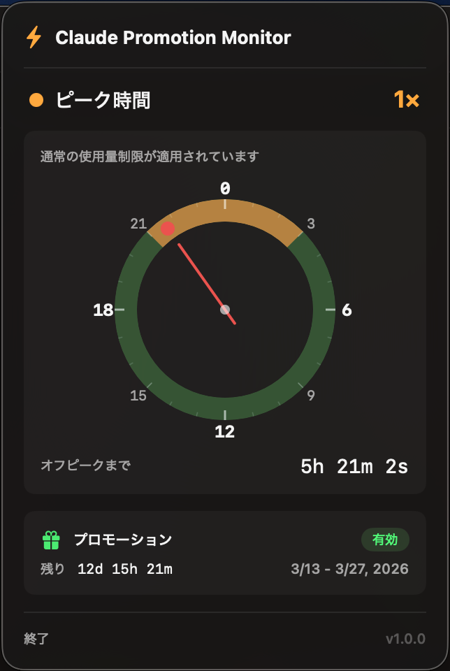

# Claude Promotion Monitor

Claudeの[2026年3月使用量プロモーション](https://support.claude.com/en/articles/14063676-claude-march-2026-usage-promotion)の状況をリアルタイムで表示するmacOSメニューバーアプリです。



## これは何？

2026年3月13日〜3月27日の期間、**オフピーク時間帯（米国東部時間 8:00〜14:00 以外）のClaude使用量が2倍**になります。ボーナス分は週間制限にカウントされません。

このアプリはメニューバーに常駐し、以下を表示します：

- **現在のステータス** — ピーク（1×）またはオフピーク（2×）を一目で確認
- **24時間時計** — ピーク／オフピーク時間帯をローカルタイムゾーンで視覚的に表示
- **カウントダウンタイマー** — 次のピーク／オフピーク切り替えまでの残り時間
- **プロモーション状況** — プロモーションの有効状態と残り期間

## 対象プラン

Free / Pro / Max / Team（Enterpriseは対象外）

## 動作要件

- macOS 14.0（Sonoma）以降
- Xcode Command Line Tools（`xcode-select --install`）

## ビルドと起動

```bash
git clone https://github.com/imnoaz/claude-promotion-monitor.git
cd claude-promotion-monitor
chmod +x build.sh
./build.sh
open "Claude Promotion Monitor.app"
```

## インストール

```bash
cp -r "Claude Promotion Monitor.app" /Applications/
```

## カスタマイズ

プロモーション期間とピーク時間帯は `Sources/TimeManager.swift` で定義されています：

```swift
// ピーク時間帯（米国東部時間）
let peakStartHour = 8
let peakEndHour = 14

// プロモーション期間（米国東部時間）
startComponents.year = 2026
startComponents.month = 3
startComponents.day = 13
// ...
endComponents.day = 28
```

これらの値を変更してリビルドすれば、別のプロモーション期間にも対応できます。

## 技術構成

- Swift / SwiftUI
- `MenuBarExtra`（`.window`スタイル）
- `Canvas`ベースのカスタム24時間時計
- Swift Package Manager

## ライセンス

MIT
